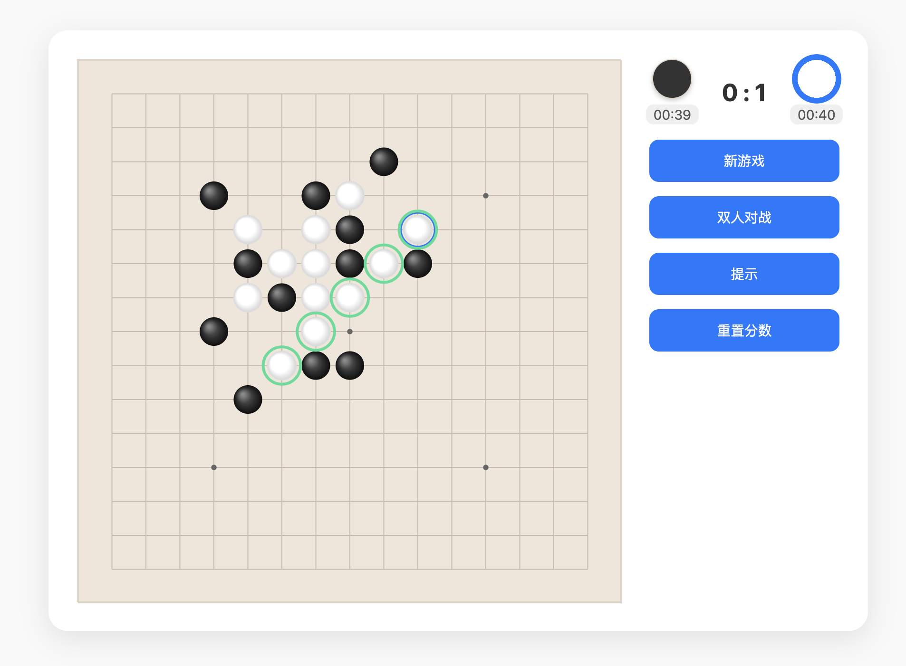
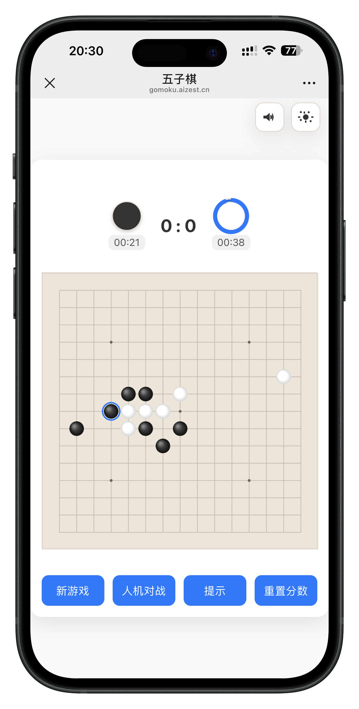

# 五子棋 (Gomoku)

基于 Web 的五子棋，支持双人/人机对战，移动端适配良好。当前版本采用双 Canvas 渲染并将 AI 放入 Web Worker，保证更高的帧率与交互流畅度。

## 主要特性
- 双 Canvas 渲染：
  - `board-canvas` 绘制棋盘线与星位（等宽网格，边缘与内部格距一致，自适应高分屏）。
  - `stones-canvas` 绘制棋子、提示与最新落子高亮（径向渐变与柔和阴影）。
- 记分与计时：
  - 轮到一方时重置并启动 40 秒倒计时；仅当前执子方显示收缩环与描边，切换时头像轻微放大提示。
  - 最后 5 秒每秒提示音；超时自动判对方胜并计分。
- 移动端 UI：顶部记分板居中；静音/切换主题按钮固定在网页右上角；触控无下拉/回弹。
- AI（Web Worker）：启发式排序 + 浅层 alpha‑beta + 置换表缓存，后台线程计算最佳落点，主线程只负责渲染。

## 启动
```bash
cd Gomoku
python3 -m http.server 8000
# 浏览器打开 http://localhost:8000
```

操作：点击棋盘交叉点落子；“人机对战”切换模式；“提示”只高亮推荐点不落子。

## UI 预览
> 你可以将你的截图放到 `Gomoku/docs/` 目录，并按如下路径命名替换：




## 文件结构
- `index.html`：页面骨架、音频资源、双 Canvas 容器。
- `style.css`：布局与主题、记分板/计时环、动画与移动端适配。
- `js/`：前端脚本（ES Modules）。
  - `js/utils.js`：公共常量与工具（`BOARD_SIZE`、方向、`inBounds`、`getPossibleMovesFor(board)`）。
  - `js/game.js`：规则与状态管理（落子、胜负、得分、候选落点、强制结束）。
  - `js/ai.js`：AI 纯函数（`findBestMoveOnBoard(board, color)`）。
  - `js/ai.worker.js`：后台线程计算最佳落点。
  - `js/ui.js`：Canvas 绘制、事件处理、计时器/提示音、与 Worker 通信。
- `audio/`：音频资源（提示音、落子音、胜利音等）。
  - `audio/place.mp3`、`audio/win.mp3`、`audio/new.mp3`、`audio/hint.mp3`、`audio/reset.mp3`、`audio/timer.mp3`。

## 自定义与调参
- 倒计时：`ui.js` 中 `INITIAL_SECONDS`（默认 40）。
- 提示音：`audio/timer.mp3`（最后 5 秒每秒播放），静音开关在右上角。
- AI 搜索：可在 `ai.js` 调整候选数量、搜索深度与评分策略。

## 兼容说明
使用 ES Modules 与模块化 Worker，建议在本地服务下运行（如上所示）。支持现代浏览器（Chrome/Safari/Firefox 新版）。
